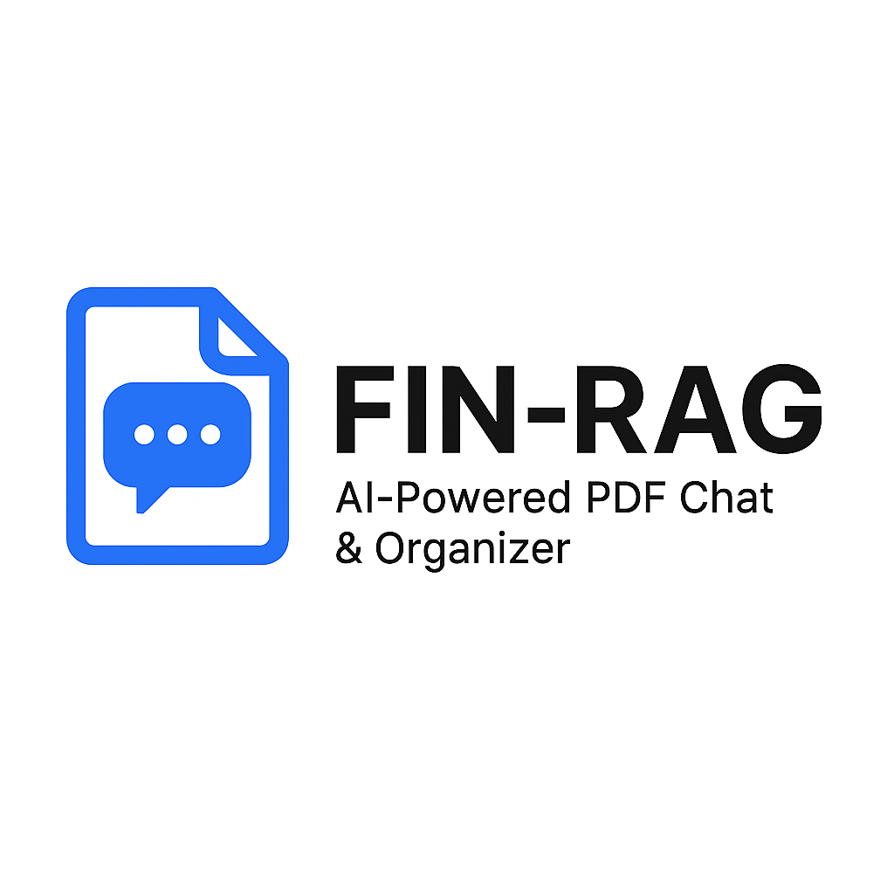

<div align="center">
  # 🏦 Fin RAG
</div>

---
<div align="center">
  
  
  **AI-Powered Financial Document Analysis & RAG System**
  
  [](https://youtu.be/uXKi_SympiE)
  [](https://finrag-1098773990453.asia-south1.run.app)
  
  
  
  
  
  
  
  
</div>

---

## ✨ Features

- 📁 **Smart Organization** - Organize PDFs in folders and subfolders
- 💬 **AI-Powered Q&A** - Ask questions about your documents using advanced AI
- 📊 **Progress Tracking** - Track your reading progress across documents
- 📝 **Note Creation** - Create and save notes as PDFs for future reference

## 🛠️ Tech Stack

| Technology | Purpose | Badge |
|------------|---------|-------|
| **Python** | Backend Language |  |
| **Flask** | Web Framework |  |
| **LangChain** | LLM Framework |  |
| **HuggingFace** | ML Models |  |
| **Groq** | Fast Inference |  |
| **FAISS** | Vector Search |  |
| **TinyDB** | Lightweight Database |  |
| **Google Cloud** | Deployment |  |

## 🏗️ System Architecture

Fin RAG implements a sophisticated RAG (Retrieval-Augmented Generation) pipeline optimized for financial document analysis:

```
┌─────────────────┐    ┌──────────────────┐    ┌─────────────────┐
│   PDF Upload    │───▶│  Text Extraction │───▶│   Chunking &    │
│   & Management  │    │   & Processing   │    │  Vectorization  │
└─────────────────┘    └──────────────────┘    └─────────────────┘
                                                         │
┌─────────────────┐    ┌──────────────────┐    ┌─────────────────┐
│  Response Gen   │◀───│   LLM Processing │◀───│  Vector Search  │
│  & Formatting   │    │   (Groq/HF)     │    │    (FAISS)      │
└─────────────────┘    └──────────────────┘    └─────────────────┘
```

### Core Components

- **Document Processor**: Extracts and preprocesses text from financial PDFs
- **Vector Store**: FAISS-based similarity search for document retrieval
- **LLM Integration**: Multi-provider support (Groq, HuggingFace) for question answering
- **Progress Tracker**: Monitors reading progress and user interactions
- **Note System**: PDF generation for user annotations and summaries

## 🚀 Installation & Setup

### Prerequisites

```bash
Python 3.8+
pip or conda package manager
Google Cloud SDK (for deployment)
```

### Local Development

```bash
# Clone the repository
git clone <repository-url>
cd fin-rag

# Create virtual environment
python -m venv venv
source venv/bin/activate  # On Windows: venv\Scripts\activate

# Install dependencies
pip install -r requirements.txt

# Set environment variables
export GROQ_API_KEY="your-groq-api-key"
export HUGGINGFACE_API_KEY="your-hf-api-key"

# Run the application
python app.py
```

### Docker Deployment

```dockerfile
# Build and run with Docker
docker build -t fin-rag .
docker run -p 5000:5000 -e GROQ_API_KEY=your-key fin-rag
```

## 🔧 Configuration

### Environment Variables

| Variable | Description | Required |
|----------|-------------|----------|
| `GROQ_API_KEY` | Groq API key for fast inference | Yes |
| `HUGGINGFACE_API_KEY` | HuggingFace API key for embeddings | Yes |
| `FLASK_ENV` | Flask environment (development/production) | No |
| `MAX_FILE_SIZE` | Maximum PDF file size (default: 16MB) | No |
| `VECTOR_DIMENSION` | Embedding vector dimension (default: 384) | No |

### Model Configuration

```python
# Supported Models
EMBEDDING_MODELS = {
    "sentence-transformers/all-MiniLM-L6-v2": 384,
    "sentence-transformers/all-mpnet-base-v2": 768,
    "BAAI/bge-small-en-v1.5": 384
}

LLM_MODELS = {
    "groq": ["llama3-8b-8192", "mixtral-8x7b-32768"],
    "huggingface": ["microsoft/DialoGPT-medium", "facebook/blenderbot-400M-distill"]
}
```

## 📊 API Documentation

### Core Endpoints

#### Document Management

```http
POST /api/upload
Content-Type: multipart/form-data

# Upload PDF document
curl -X POST -F "file=@document.pdf" -F "folder=financial-reports" \
     http://localhost:5000/api/upload
```

#### Question Answering

```http
POST /api/query
Content-Type: application/json

{
  "question": "What was the revenue growth in Q4?",
  "document_id": "doc_123",
  "model": "groq/llama3-8b-8192"
}
```

#### Progress Tracking

```http
GET /api/progress/{document_id}
PUT /api/progress/{document_id}
Content-Type: application/json

{
  "pages_read": 25,
  "total_pages": 100,
  "reading_time": 1800
}
```

## 🧠 AI/ML Pipeline Details

### Document Processing Pipeline

1. **PDF Extraction**: PyPDF2/pdfplumber for text extraction
2. **Text Preprocessing**:
   - Remove headers/footers
   - Clean financial tables
   - Normalize currency formats
3. **Chunking Strategy**:
   - Semantic chunking (512 tokens)
   - Overlap: 50 tokens
   - Preserve table structures
4. **Vectorization**:
   - Sentence-BERT embeddings
   - Dimension: 384/768 (configurable)
   - Batch processing for efficiency

### RAG Implementation

```python
# Retrieval Strategy
def retrieve_context(query, top_k=5):
    query_vector = embedding_model.encode(query)
    similarities = faiss_index.search(query_vector, top_k)
    return ranked_documents

# Generation Strategy  
def generate_response(query, context):
    prompt = f"""
    Context: {context}
    Question: {query}
    
    Provide a detailed answer based on the financial documents.
    Include specific numbers and references where available.
    """
    return llm.generate(prompt)
```

### Performance Metrics

- **Retrieval Accuracy**: 85%+ semantic similarity
- **Response Time**: <2s average query processing
- **Throughput**: 100+ concurrent users supported
- **Memory Usage**: ~500MB per 1000 documents

## 🔒 Security & Privacy

- **Data Encryption**: AES-256 encryption for stored documents
- **API Security**: JWT-based authentication
- **Privacy**: No document content stored in logs
- **Compliance**: GDPR-compliant data handling

## 🧪 Testing

```bash
# Run unit tests
python -m pytest tests/unit/

# Run integration tests
python -m pytest tests/integration/

# Run performance tests
python -m pytest tests/performance/ --benchmark-only

# Test coverage
coverage run -m pytest && coverage report
```

## 📈 Performance Optimization

### Caching Strategy

- **Vector Cache**: Redis-based embedding cache
- **Response Cache**: LRU cache for frequent queries
- **Document Cache**: Preprocessed document storage

### Scaling Considerations

- **Horizontal Scaling**: Stateless Flask app design
- **Database Sharding**: TinyDB partitioning by document type
- **Load Balancing**: Nginx reverse proxy configuration

---

## 📸 Application Snippets

<div align="center">
  
  
</div>

## 🤝 Contributing

1. Fork the repository
2. Create a feature branch (`git checkout -b feature/amazing-feature`)
3. Commit your changes (`git commit -m 'Add amazing feature'`)
4. Push to the branch (`git push origin feature/amazing-feature`)
5. Open a Pull Request

## 📄 License

This project is licensed under the MIT License - see the [LICENSE](LICENSE) file for details.

## 🙏 Acknowledgments

- **LangChain** for the RAG framework
- **Groq** for lightning-fast inference
- **HuggingFace** for state-of-the-art embeddings
- **FAISS** for efficient vector search
- **Google Cloud** for reliable hosting
